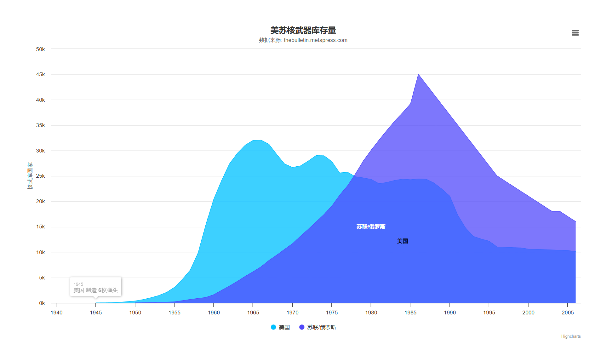
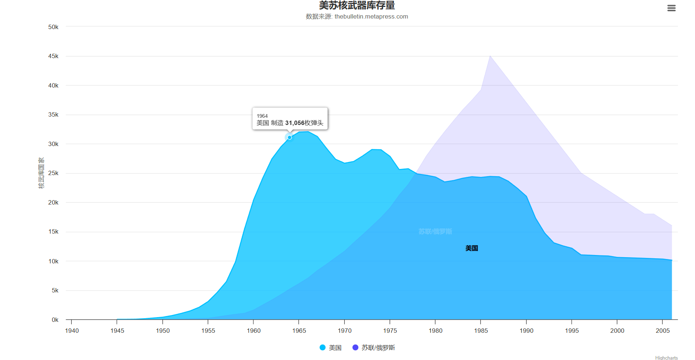
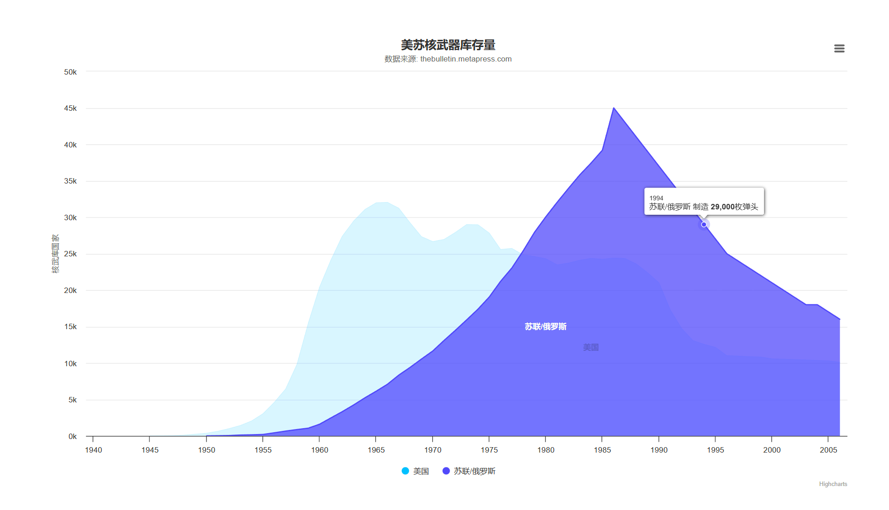
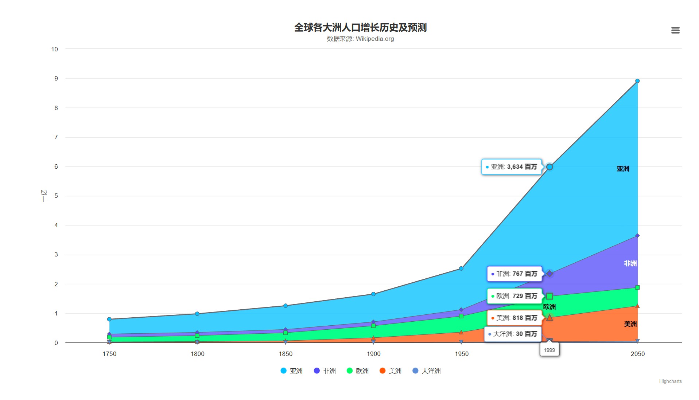
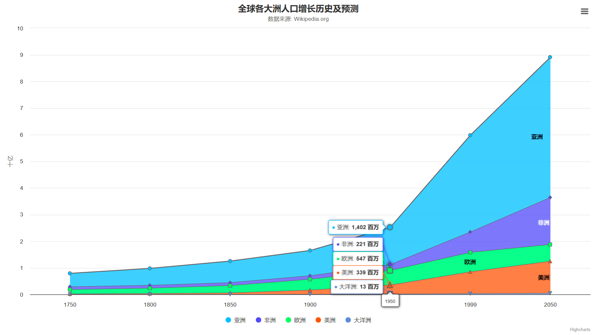
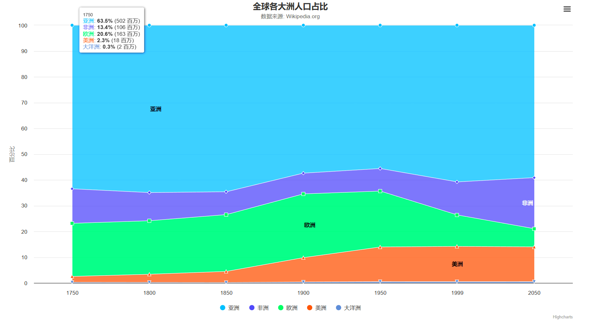

## 面积图

### 基础面积图

```html
<html lang="en">
<head>
    <meta charset="UTF-8">
    <title>基础面积图</title>

    <script src="./js/highcharts.js"></script>
    <script src="./js/exporting.js"></script>
    <script src="./js/series-label.js"></script>
    <script src="./js/zh_cn.js"></script>

</head>

<style>
    #container {
        width: 70vw;
        height: 70vh;
        position: absolute;
        top: 50%;
        left: 50%;
        transform: translate(-50%, -50%);
    }
</style>
<body>
<div id="container"></div>
<script>
    var chart = Highcharts.chart('container', {
        chart: {
            type: 'area'
        },
        title: {
            text: '美苏核武器库存量'
        },
        subtitle: {
            text: '数据来源: <a href="https://thebulletin.metapress.com/content/c4120650912x74k7/fulltext.pdf">' +
                'thebulletin.metapress.com</a>'
        },
        xAxis: {
            allowDecimals: false
        },
        yAxis: {
            title: {
                text: '核武库国家'
            },
            labels: {
                formatter: function ()
                {
                    return this.value / 1000 + 'k';
                }
            }
        },
        tooltip: {
            pointFormat: '{series.name} 制造 <b>{point.y:,.0f}</b>枚弹头'
        },
        plotOptions: {
            area: {
                pointStart: 1940,
                marker: {
                    enabled: false,
                    symbol: 'circle',
                    radius: 2,
                    states: {
                        hover: {
                            enabled: true
                        }
                    }
                }
            }
        },
        series: [{
            name: '美国',
            data: [null, null, null, null, null, 6, 11, 32, 110, 235, 369, 640,
                1005, 1436, 2063, 3057, 4618, 6444, 9822, 15468, 20434, 24126,
                27387, 29459, 31056, 31982, 32040, 31233, 29224, 27342, 26662,
                26956, 27912, 28999, 28965, 27826, 25579, 25722, 24826, 24605,
                24304, 23464, 23708, 24099, 24357, 24237, 24401, 24344, 23586,
                22380, 21004, 17287, 14747, 13076, 12555, 12144, 11009, 10950,
                10871, 10824, 10577, 10527, 10475, 10421, 10358, 10295, 10104]
        }, {
            name: '苏联/俄罗斯',
            data: [null, null, null, null, null, null, null, null, null, null,
                5, 25, 50, 120, 150, 200, 426, 660, 869, 1060, 1605, 2471, 3322,
                4238, 5221, 6129, 7089, 8339, 9399, 10538, 11643, 13092, 14478,
                15915, 17385, 19055, 21205, 23044, 25393, 27935, 30062, 32049,
                33952, 35804, 37431, 39197, 45000, 43000, 41000, 39000, 37000,
                35000, 33000, 31000, 29000, 27000, 25000, 24000, 23000, 22000,
                21000, 20000, 19000, 18000, 18000, 17000, 16000]
        }]
    });
</script>

</body>
</html>
```











### 堆叠面积图

```html
<html lang="en">
<head>
    <meta charset="UTF-8">
    <title>堆叠面积图</title>

    <script src="./js/highcharts.js"></script>
    <script src="./js/exporting.js"></script>
    <script src="./js/series-label.js"></script>
    <script src="./js/zh_cn.js"></script>

</head>

<style>
    #container {
        width: 70vw;
        height: 70vh;
        position: absolute;
        top: 50%;
        left: 50%;
        transform: translate(-50%, -50%);
    }
</style>
<body>
<div id="container"></div>
<script>
    var chart = Highcharts.chart('container', {
        chart: {
            type: 'area'
        },
        title: {
            text: '全球各大洲人口增长历史及预测'
        },
        subtitle: {
            text: '数据来源: Wikipedia.org'
        },
        xAxis: {
            categories: ['1750', '1800', '1850', '1900', '1950', '1999', '2050'],
            tickmarkPlacement: 'on',
            title: {
                enabled: false
            }
        },
        yAxis: {
            title: {
                text: '十亿'
            },
            labels: {
                formatter: function ()
                {
                    return this.value / 1000;
                }
            }
        },
        tooltip: {
            split: true,
            valueSuffix: ' 百万'
        },
        plotOptions: {
            area: {
                stacking: 'normal',
                lineColor: '#666666',
                lineWidth: 1,
                marker: {
                    lineWidth: 1,
                    lineColor: '#666666'
                }
            }
        },
        series: [{
            name: '亚洲',
            data: [502, 635, 809, 947, 1402, 3634, 5268]
        }, {
            name: '非洲',
            data: [106, 107, 111, 133, 221, 767, 1766]
        }, {
            name: '欧洲',
            data: [163, 203, 276, 408, 547, 729, 628]
        }, {
            name: '美洲',
            data: [18, 31, 54, 156, 339, 818, 1201]
        }, {
            name: '大洋洲',
            data: [2, 2, 2, 6, 13, 30, 46]
        }]
    });
</script>

</body>
</html>
```








### 百分比堆叠面积图

```html
<html lang="en">
<head>
    <meta charset="UTF-8">
    <title>百分比堆叠面积图</title>

    <script src="./js/highcharts.js"></script>
    <script src="./js/exporting.js"></script>
    <script src="./js/series-label.js"></script>
    <script src="./js/zh_cn.js"></script>

</head>

<style>
    #container {
        width: 70vw;
        height: 70vh;
        position: absolute;
        top: 50%;
        left: 50%;
        transform: translate(-50%, -50%);
    }
</style>
<body>
<div id="container"></div>
<script>
    var chart = Highcharts.chart('container', {
        chart: {
            type: 'area'
        },
        title: {
            text: '全球各大洲人口占比'
        },
        subtitle: {
            text: '数据来源: Wikipedia.org'
        },
        xAxis: {
            categories: ['1750', '1800', '1850', '1900', '1950', '1999', '2050'],
            tickmarkPlacement: 'on',
            title: {
                enabled: false
            }
        },
        yAxis: {
            title: {
                text: '百分比'
            }
        },
        tooltip: {
            pointFormat: '<span style="color:{series.color}">{series.name}</span>: <b>{point.percentage:.1f}%</b> ({point.y:,.0f} 百万)<br/>',
            shared: true
        },
        plotOptions: {
            area: {
                stacking: 'percent',
                lineColor: '#ffffff',
                lineWidth: 1,
                marker: {
                    lineWidth: 1,
                    lineColor: '#ffffff'
                }
            }
        },
        series: [{
            name: '亚洲',
            data: [502, 635, 809, 947, 1402, 3634, 5268]
        }, {
            name: '非洲',
            data: [106, 107, 111, 133, 221, 767, 1766]
        }, {
            name: '欧洲',
            data: [163, 203, 276, 408, 547, 729, 628]
        }, {
            name: '美洲',
            data: [18, 31, 54, 156, 339, 818, 1201]
        }, {
            name: '大洋洲',
            data: [2, 2, 2, 6, 13, 30, 46]
        }]
    });
</script>

</body>
</html>
```





